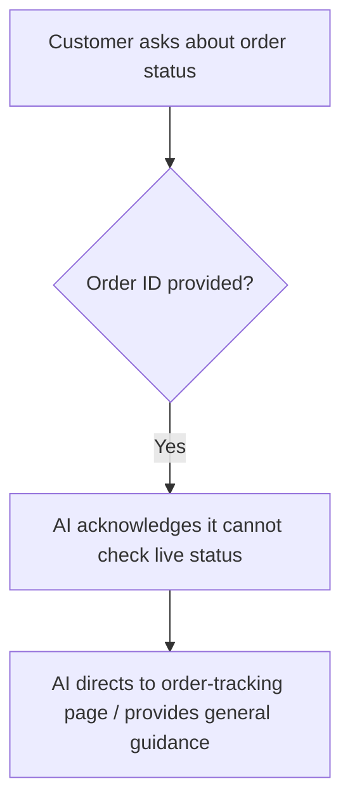
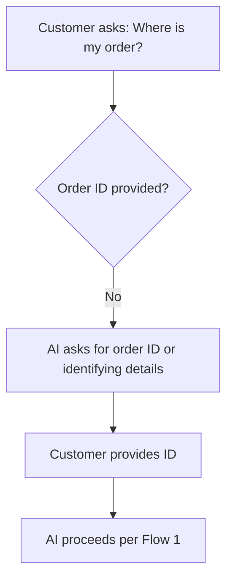
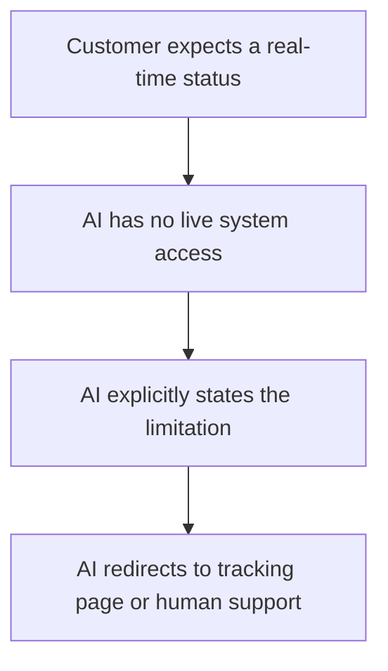
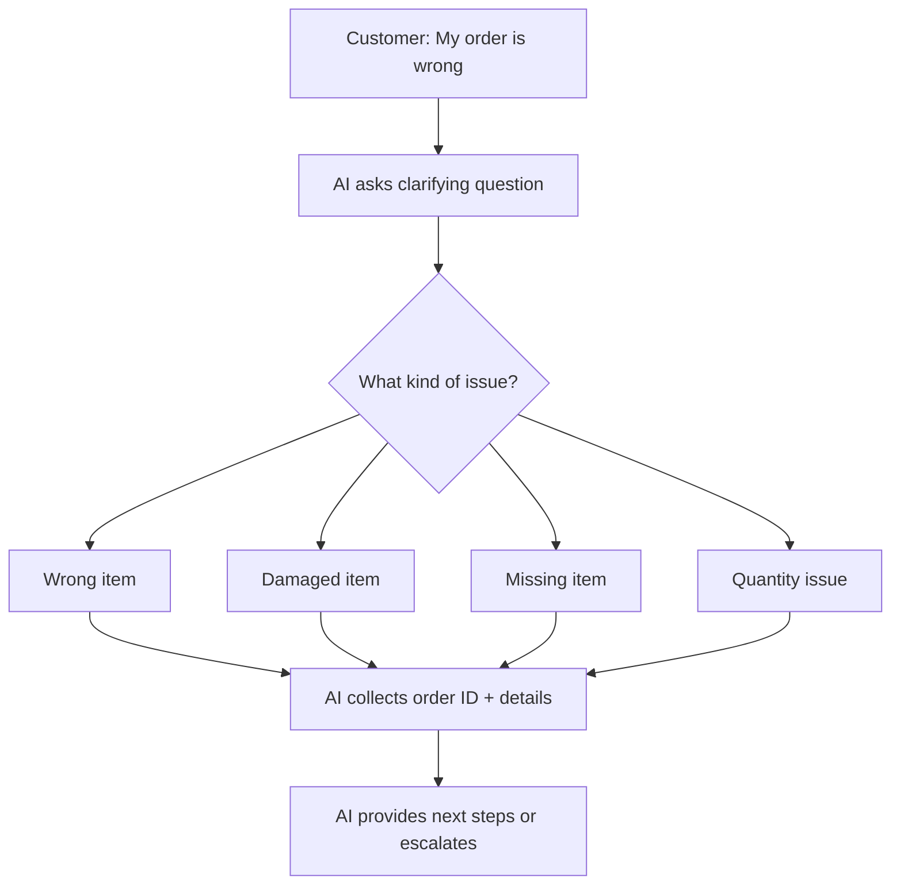
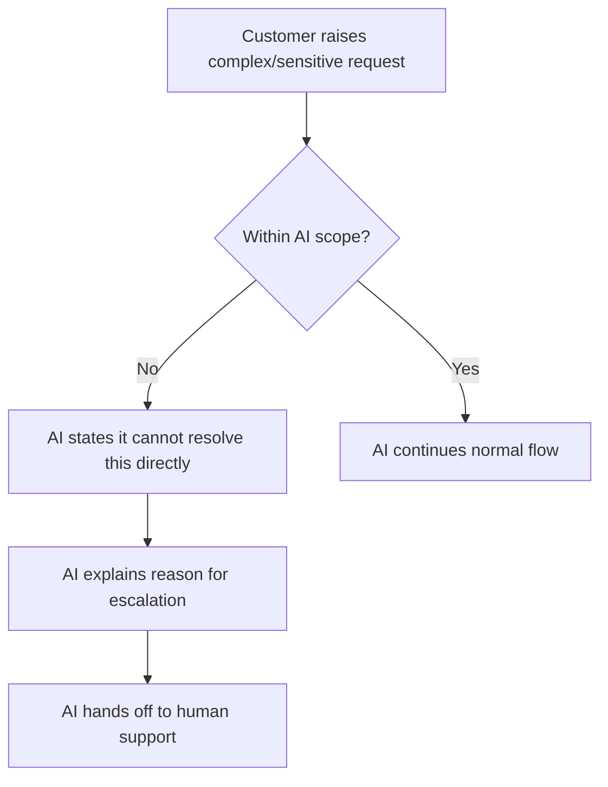

# Conversation Flows — ShopEase AI Customer Support Assistant

## Flow 1 — Happy path (order tracking with ID)

## Flow 2 — Missing information

## Flow 3 — AI limitation (no database access)

## Flow 4 — Ambiguous query

## Flow 5 — Escalation

